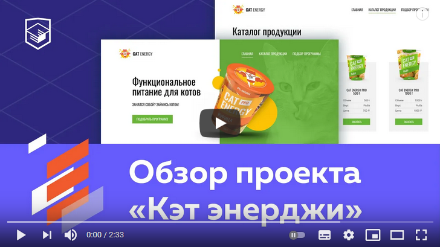

# Интернет-магазин «Cat Energy»

Адаптивно-отзывчивая кроссбраузерная вёрстка 3-страничного интернет-магазина без использования JavaScript (за исключением карты) с ретинизацией изображений.

[](https://www.youtube.com/watch?v=1Jr2JZSRj84 "Обзор проекта «Кэт энерджи» - YouTube")

---

### Используемые подходы и технологии:

* Методология БЭМ
* Препроцессор Sass
* Gulp
* Адаптивная и отзывчивая вёрстка
* Кроссбраузерность
* Семантическая разметка, доступность
* Ретинизация и оптимизация изображений
* SVG - спрайты
* Pixel Perfect

---

### Установка пакетов:

```
npm install
```
### Сборка и запуск:

```
npm start
```

---

<a href="https://htmlacademy.ru/intensive/adaptive"></a>

Репозиторий создан для обучения на профессиональном онлайн‑курсе «[HTML и CSS, уровень 2](https://htmlacademy.ru/intensive/adaptive)» от [HTML Academy](https://htmlacademy.ru).
